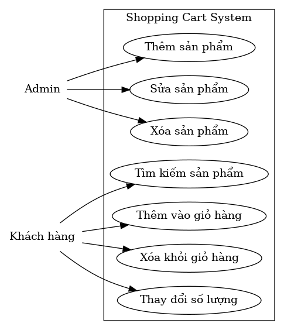
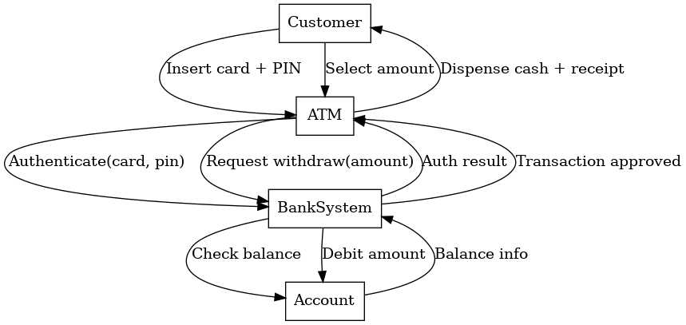

# Project Report — Lab 05: Tích hợp, quản lý & báo cáo

## 1. Thông tin nhóm
- Trần Mai Chi – N23DCPT067 – Leader  
- Nguyễn Thị Khánh An – N23DCPT059 – Developer (Backend/API, DB)  
- Hoàng Ngọc Linh– N23DCPT088 – Developer (Frontend/UI)

## 2. Mục tiêu
Hoàn thiện quy trình phần mềm từ thiết kế (UML) đến triển khai giao diện (HTML/CSS/JS), quản lý mã nguồn bằng Git/GitHub, viết báo cáo và phát hành phiên bản **v1.0**.

## 3. Artifacts đã hoàn thành
### 3.1 Use Case Diagram


### 3.2 Sequence Diagram


### 3.3 Form Login (HTML/CSS/JS)
- File: `lab5.html`   
- Yêu cầu đáp ứng: **Username**, **Password**, **Remember me**, **Login**, **Cancel**  
- Kiểm tra dữ liệu: tối thiểu 3 ký tự cho Username, 6 ký tự cho Password; báo lỗi rõ ràng; toggle hiện/ẩn mật khẩu; lưu Username nếu chọn “Remember me”.

## 4. Quy trình & công cụ
- Công cụ: Visual Studio Code, Git, GitHub.  
- Luồng làm việc:
  1. Thiết kế UML (Use Case, Sequence).  
  2. Coding form login bằng HTML/CSS/JS, test cục bộ/Lite Server.  
  3. Quản lý mã nguồn với Git, đẩy lên GitHub.  
  4. Tổ chức repo.

## 5. Hướng dẫn chạy
- Cục bộ: mở trực tiếp `lab5.html` trong trình duyệt.  
- Trên GitHub Pages (tuỳ chọn): *Settings → Pages → Deploy from a branch → main / (root)*. Lấy URL demo để đưa vào README.

## 6. Hướng dẫn Git: push code, update README, tạo tag v1.0
```bash
# Thêm/đổi nội dung README & REPORT rồi commit
git add .
git commit -m "Lab 05: tích hợp UML + Form Login + REPORT.md, update README"

# Đẩy lên GitHub
git push

# Tạo tag phát hành v1.0 và đẩy tag
git tag -a v1.0 -m "Release v1.0"
git push origin v1.0